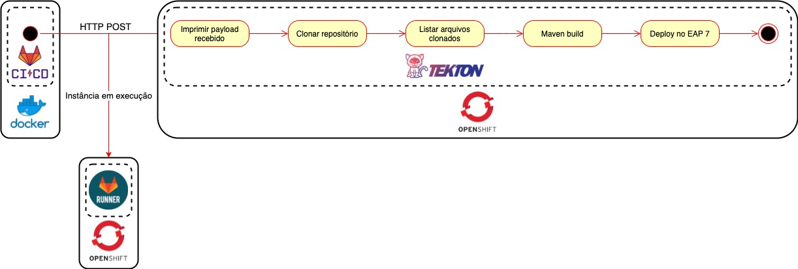

# Pipeline CI/CD Tekton + GitlabCI to deploy in JBoss EAP 7 environment

## Arquitetura


### Observação
You can find all the data related to the development of this pipeline inside the `gitlab-ci` directory.

## Steps to pipeline creation

### Namespace creation
```
oc login --server=<openshift_cluster_url_login>
oc new-project <namespace_name_here>
```

### Pipeline creation
Pipeline creation consists of creating the `pipeline.yaml` file and therefore its provisioning in Openshift. In order to start the provisioning, execute:
```
oc create -f pipeline.yaml
```
The following topics will describe aspects about this file.

#### Parameters
Below a list of parameters used in the pipeline and its tasks:
* PAYLOAD: Represents the payload as a whole in its JSON form. It is sent by the Trigger Template.
* GIT_CLONE_URL: Git repository URL that shall be cloned by the git-clone cluster-task. This data is inside the payload.
* GIT_BRANCH: Git repository branch that shall be cloned by the git-clone cluster-task. This data is inside the payload.
* JBOSS_EAP7_SERVER_GROUP: JBoss EAP 7 server group where the application will be deployed. This data is inside the payload.
* DEPLOYED_ARTIFACT_PATH: Artefact path which will be deployed in JBoss EAP 7 environment. This data is inside the payload.

#### Workspaces
Workspaces represent common areas where information can be exchanged among tasks and cluster-tasks or files that might be mounted inside task's containers. Below the list of used workspaces:
* shared-workspace
  * Kind: Persistent Volume Claim (PVC)
  * Claim Name: shared-workspace
* maven-settings
  * Kind: Config Map
  * Nome do Config Map: maven-settings

### Task creation

#### Task echo-payload
* Definition: Prints on terminal the payload received bu the Trigger Template.
* Kind: Task
  * File: tasks/echo-payload-task.yaml
* Parameter:
  * PAYLOAD: Payload sent by the Trigger Template. Payload contains necessary data in order to the pipeline is able to accomplish its activities.

#### Task git-clone
* Definition: Execute the git clone of a repository passed by parameter.
* Kind: Cluster Task
* Parameter:
  * url: Repository URL to be cloned.
  * sslVerify: Flag that enables or disable the SSL verification.
  * deleteExisting: Flag to determine if any temporary data should be deleted or not before the 'git clone'.
  * verbose: Flag which sets is the operation will be verbose or not.
  * revision: Branch to be cloned.
  * gitInitImage: Base image to container which represents the task. This field comes already fulfilled with a standard base image.
* Workspaces:
  * shared-workspace
* Additional procedures:
    * It's necessary the creation of a secret to git clone via SSH the application source code.
    ```
    oc create secret generic gitlab-ssh-key --from-file=ssh-privatekey=<path_to_your_private_key> --type="kubernetes.io/ssh-auth"
    ```
  * It's necessary to annotate the secret.
    ``` 
    oc annotate secret gitlab-ssh-key tekton.dev/git-0='<url_to_gitlab_without_https>:<custom_port_if_exists>'
    ```
  * In order to the code can be downloaded it's necessary to associate the created secret with the service account used by the pipeline.
    ```
    oc secrets link pipeline gitlab-ssh-key
    ```

#### Task verify-cloned-repo
* Definition: Lists workspace's files related to the task.
* Kind: Task
  * File: tasks/ls-task.yaml
* Workspaces:
  * shared-workspace

#### Task maven-build
* Definition: Performs a maven build (install, package, etc.) in the most general way possible.
* Kind: Cluster Task
* Parameter:
  * MAVEN_IMAGE: Base image to the container which represents the task. This field comes already fulfilled with a standard base image.
  * GOALS: Array type parameter which contains the goals to be used.
  * CONTEXT_DIR: Base directory for the pom.xml file and maven submodules search.
* Workspaces:
  * shared-workspace
  * maven-settings

#### Task deploy
* Definição: Realize o deploy de um artefato ear, war ou jar no ambiente JBoss EAP 7.
* Tipo: Task
  * Arquivo: tasks/jboss-eap7-deploy.yaml
* Parâmetros:
  * SERVER_GROUP: Representa o server group no qual o artefato será deployado.
  * DEPLOYED_ARTIFACT_PATH: Caminho do artefato que será deployado. Este caminho leva em conta o diretório base de build como início.
  * CONNECTION_DATA_SECRET_NAME: Nome da secret que contém os dados de conexão com o ambiente EAP 7.
* Workspaces:
  * shared-workspace

#### Secret com dados para conexão no EAP 7
```
oc create secret generic jboss-eap7-connection-data --from-literal=CONTROLLER_IP="<controller_ip>" --from-literal=MGNT_USER=<management_user> --from-literal=MGNT_PASSWORD=<management_password>
```